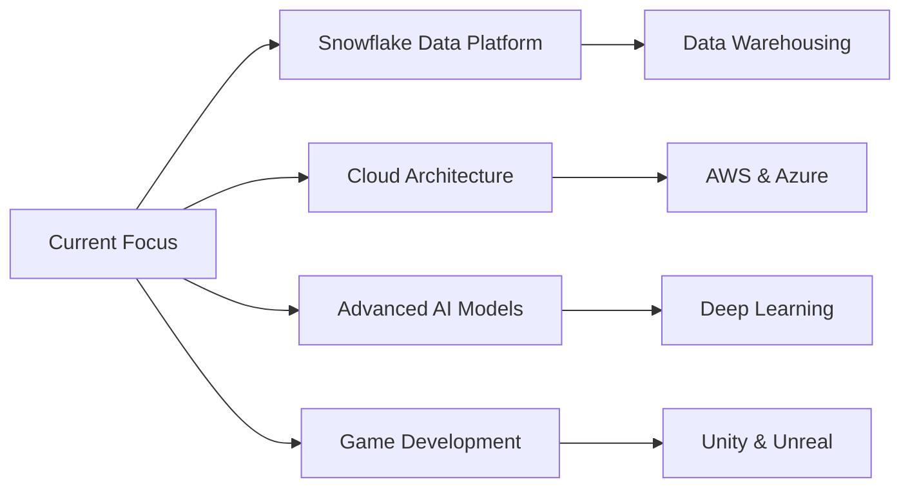

<div align="center">
  
# 👋 Hi, I'm Fabián Abarca
### @fabsswd


[](https://www.linkedin.com/in/fabarcamonge/)
[](mailto:fabarcamonge@gmail.com)
[](mailto:info@frameworksoft.io)

</div>

---

<div align="center">

## 🚀 About Me

</div>

<div align="center">

<table>
<tr>
<td width="50%">

```javascript
const fabs = {
  role: "Full-Stack Developer",
  company: "Infinite Computer Solutions",
  location: "Costa Rica 🇨🇷",
  experience: "5+ years",
  passion: ["Problem Solving", 
            "Clean Code", 
            "Game Development"],
  currentFocus: "Cloud Architecture & AI"
};
```

</td>
<td width="50%">

- 💼 Full-Stack Engineer at **Infinite Computer Solutions**
- 🎓 Software Engineering Student
- 🚀 Founder of **CherryDev** (2020-2023)
- 🎮 Game Development Enthusiast
- 🥋 Martial Arts Background
- 📚 Lifelong Learner

</td>
</tr>
</table>

</div>

---

## 🛠️ Tech Stack

<div align="center">

### Languages


### Frontend


### Backend


### Databases


### AI & Machine Learning


### DevOps & Cloud


### Game Development


</div>

---

<div align="center">

## 💼 Professional Experience

</div>

<details open>
<summary><b>🔷 Full-Stack Engineer @ Infinite Computer Solutions</b> (2025 - Present)</summary>
<br>

- 🏢 Developing enterprise software solutions for corporate clients
- 📝 Leading documentation best practices across multiple projects
- 🔧 Specialized in Full-Stack development and complex problem-solving
- 👥 Mentoring and supporting team members with technical challenges
- 🌐 Working on Fiserv client projects with modern tech stacks

</details>

<details>
<summary><b>🚀 Founder & Software Developer @ CherryDev</b> (2020 - 2023)</summary>
<br>

- 📱 Led development of diverse mobile applications using modern frameworks
- 👨‍💻 Conducted comprehensive code reviews and quality assurance
- 🎯 Managed end-to-end project delivery and client relationships
- 💡 Enhanced team performance through mentorship and best practices
- 🛠️ Built custom solutions using JavaScript, HTML5, and various frameworks

</details>

<details>
<summary><b>💻 Freelance Software Developer</b> (2023 - 2025)</summary>
<br>

- 🎨 Crafted custom software solutions for diverse client needs
- 🔄 Managed multiple concurrent projects from consultation to delivery
- 🌟 Specialized in Full-Stack development with focus on quality
- 📞 Maintained strong client communication and project transparency
- ⚙️ Integrated cutting-edge technologies and modern best practices

</details>

<details>
<summary><b>🏦 Intern @ SES Digital</b> (Oct 2023 - Nov 2023)</summary>
<br>

- 🔍 Assisted with research and data analysis projects
- 🏛️ Collaborated on technical projects using specialized banking software
- 📊 Gained experience in financial technology sector
- 🤝 Worked with cross-functional teams on enterprise solutions

</details>

---

## 🏆 Achievements & Certifications

<div align="center">

| Achievement | Description |
|-------------|-------------|
| 🐍 **Certified Senior Python Developer** | Advanced Python proficiency and best practices |
| 🤖 **AI & Machine Learning** | Proficient in developing and deploying AI solutions |
| 🌐 **Full-Stack Specialization** | Expert in end-to-end application development |
| 🎓 **Technical Degree in AI** | Specialized education in Artificial Intelligence |
| 📋 **PMP Certification** | Pursuing Project Management Professional (Q2 2026) |

</div>

---

<div align="center">

## 🎯 What I Build

</div>

<div align="center">

<table>
<tr>
<td width="50%">

### 🌐 Web Applications
- React, Angular, Vue.js frontends
- Node.js, Django, Spring Boot backends
- RESTful APIs and microservices
- Real-time applications with WebSockets

### 📱 Mobile Development
- React Native cross-platform apps
- .NET MAUI applications
- Flutter development
- iOS & Android native solutions

### 🤖 AI Solutions
- Machine Learning models
- AI agent development
- Natural Language Processing
- Computer Vision applications

</td>
<td width="50%">

### 🎮 Game Development
- Unity 3D/2D game projects
- Unreal Engine experiences
- Game mechanics and prototypes
- Interactive simulations

### ⛓️ Blockchain & Web3
- Smart contract development
- Decentralized applications (DApps)
- NFT platforms
- Blockchain integrations

### 🔧 Custom Solutions
- Business automation tools
- Data analytics platforms
- API integrations
- Cloud-native applications

</td>
</tr>
</table>

</div>

---

<div align="center">

## 🌟 Currently Exploring

</div>



---

<div align="center">

## 💡 Fun Facts

</div>

<div align="center">

| 🎮 | 🥋 | 📚 | ✨ |
|:---:|:---:|:---:|:---:|
| Game Dev Enthusiast | Martial Arts Background | Lifelong Learner | Clean Code Advocate |

</div>

- 🌱 Currently mastering **Snowflake** and cloud data platforms
- 🎮 Building game prototypes in my spare time
- 📖 Always learning new technologies and frameworks
- 🥋 Martial arts discipline translates to coding discipline
- 🚀 Passionate about mentoring new developers
- 🎯 Goal: Become a PMP certified project manager by Q2 2026

---

<div align="center">

## 📫 Let's Connect!

</div>

<div align="center">

[](https://www.linkedin.com/in/fabarcamonge/)
[](mailto:fabarcamonge@gmail.com)
[](mailto:info@frameworksoft.io)

</div>

<div align="center">

### 💬 Open to collaborate on exciting projects!

*I love connecting with different people, so feel free to reach out if you want to discuss tech, collaborate on projects, or just chat about software development!*

---


**⭐ From [fabsswd](https://github.com/fabsswd) with ❤️**

</div>
